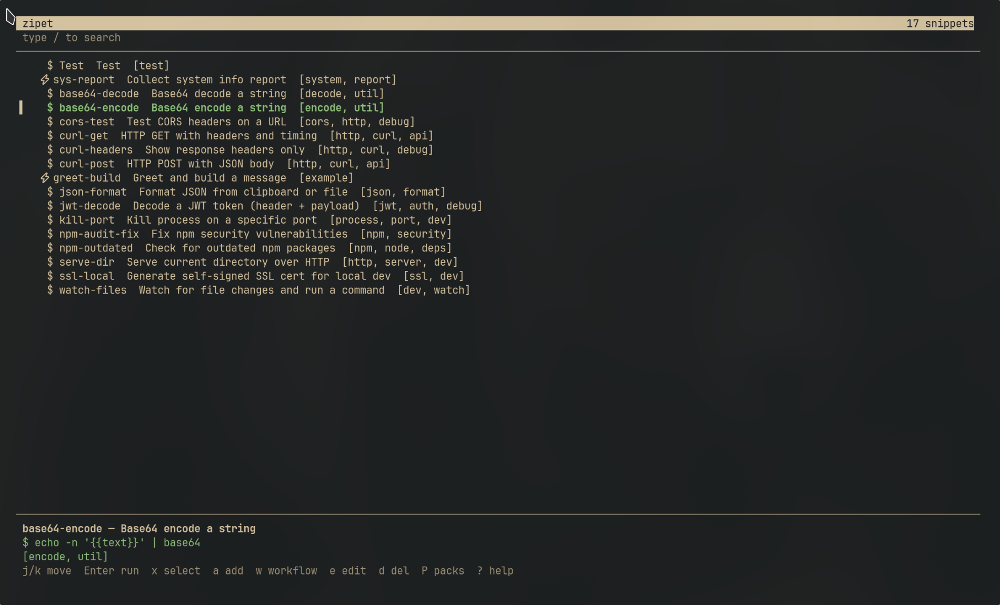
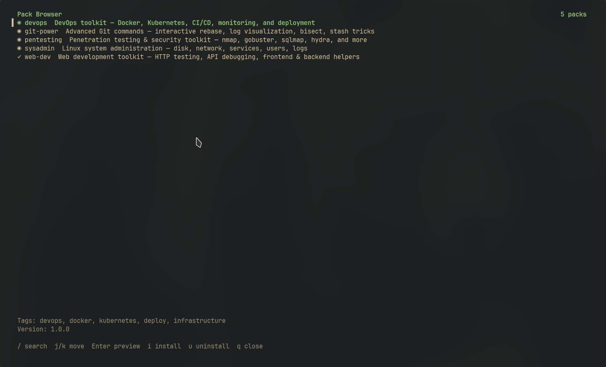

<p align="center">
  
</p>

<h3 align="center">Your commands start as one-liners.<br/>They shouldn't stay that way.</h3>

<p align="center">
  
  
  
  
</p>

---

## The idea

Every useful command you've ever written followed the same path: you typed it once, it worked, and then it disappeared into your history. Maybe you saved it in a text file. Maybe you didn't.

zipet gives that command a life:

```
  Save it          →  zipet add "docker build -t {{image}}:{{tag}} ."
  Parameterize it  →  {{image}} and {{tag}} are prompted at runtime
  Chain it         →  build → test → deploy as a workflow
  Run them all     →  zipet parallel build-api build-web run-tests
  Share it         →  zipet pack create my-toolkit
  Expose it to AI  →  your agent calls zipet via MCP
```

That's the progression. You start by saving a command. You end with a portable, shareable automation layer that works from the terminal, a TUI, or an AI agent — all from the same TOML files, in a single static binary with zero dependencies.

The last step matters more than it looks. zipet includes an MCP server so AI coding agents use your verified, tested commands instead of hallucinating new ones. Your snippet library becomes a semantic firewall between what an agent *wants* to run and what you've *approved* to run.

---

## 📥 Install

```bash
curl -sSL https://raw.githubusercontent.com/Luisgarcav/zipet/main/scripts/install.sh | bash
```

The script detects your OS and architecture, downloads the right binary, and places it in `~/.local/bin/`. That's it.

> Supports **Linux** (x86_64 / aarch64) and **macOS** (x86_64 / Apple Silicon).
>
> ⚠️ **Windows** is not supported yet, but it's planned for a future release.

---

## 🔄 Update

```bash
zipet update
```

zipet checks GitHub for the latest release, compares versions, and replaces itself automatically.

```bash
zipet update --force   # force update even if local version is newer
```

---

## 🎬 Quick Start

```bash
# Initialize (creates ~/.config/zipet with example snippets)
zipet init

# Save a command
zipet add "docker build -t {{image}}:{{tag}} ."

# Find and run it
zipet run docker

# Or open the TUI and browse everything
zipet
```

---

## Start simple

You saved a command. Now find it and run it.

zipet uses fuzzy search with scoring for word boundaries, camelCase, consecutive matches, and exact prefixes. You don't need to remember the full name — just enough to narrow it down:

```bash
zipet run dk        # matches "docker-build", "disk-usage", etc.
zipet run "find lg" # matches "find-large"
zipet docker        # unknown commands are treated as implicit "run"
```

Or skip the CLI entirely and browse everything in the TUI:

<p align="center">
  
</p>

Launch it with just `zipet`. Vim-native keybindings, powered by [libvaxis](https://github.com/rockorager/libvaxis):

| Key | Action |
|-----|--------|
| `j` / `k` | Navigate up / down |
| `gg` / `G` | Jump to first / last |
| `/` | Focus search bar |
| `Enter` | Run selected snippet |
| `a` | Add new snippet |
| `e` | Edit in `$EDITOR` |
| `d` | Delete (with confirmation) |
| `y` | Yank command to clipboard |
| `Space` | Toggle preview pane |
| `t` | Filter by tag |
| `?` | Toggle help sidebar |
| `:q` | Quit |

<details>
<summary>All TUI keybindings</summary>

| Key | Action |
|-----|--------|
| `Ctrl-D` / `Ctrl-U` | Page down / up |
| `w` | Create new workflow (inline wizard) |
| `p` | Paste from clipboard |
| `o` | Open TOML file in editor |
| `i` | Full info panel |
| `W` | Workspace picker |
| `P` | Pack browser |
| `:w` | Save all |
| `:wq` | Save & quit |
| `:tags` | Tag picker |
| `:export` | Export snippets |
| `:ws` | Workspace picker |
| `:packs` | Pack browser |

</details>

---

## Parametrize

A saved command becomes useful when it adapts. Add `{{placeholders}}` and zipet prompts for values at runtime:

```toml
[snippets.find-large]
desc = "Find large files"
tags = ["system", "find"]
cmd = "find {{path}} -type f -size +{{size}} -exec ls -lh {} \\;"

[snippets.find-large.params]
path = { prompt = "Search path", default = "." }
size = { prompt = "Minimum size", default = "100M" }
```

Parameters can be simple text, a predefined list, or dynamically generated:

| Type | Description |
|------|-------------|
| `prompt` + `default` | Text input with a default value |
| `options` | Pick from a numbered list |
| `command` | Runs a shell command to populate choices (e.g. `git branch`) |

There are also built-in variables that resolve automatically — no prompts needed:

| Variable | Value |
|---|---|
| `{{user}}` | Current username |
| `{{hostname}}` | Machine hostname |
| `{{cwd}}` | Current working directory |
| `{{date}}` | Today's date (`YYYY-MM-DD`) |
| `{{datetime}}` | ISO 8601 datetime |
| `{{timestamp}}` | Unix timestamp |
| `{{os}}` | Operating system |
| `{{arch}}` | CPU architecture |
| `{{git_branch}}` | Current git branch |
| `{{git_sha}}` | Short git commit SHA |
| `{{git_root}}` | Git repository root path |
| `{{clipboard}}` | Clipboard contents (X11/Wayland/macOS) |

---

## Chain

One parameterized command is useful. Several of them in sequence is a deployment pipeline. Workflows let you chain snippets and commands with error handling and data passing between steps:

```bash
zipet workflow add       # interactive wizard
zipet workflow run deploy-all
zipet wf ls              # list all workflows
zipet wf show deploy-all # inspect steps
```

What makes workflows more than a shell script:

- **Snippet references** — reuse existing snippets as steps, don't duplicate commands
- **Inter-step data** — `{{prev_stdout}}` and `{{prev_exit}}` pass output between steps
- **Failure policies** — each step decides what happens on error: `stop`, `continue`, or `skip_rest`
- **Shared params** — prompted once, available to every step
- **Editable** — `zipet wf edit <name>` opens the TOML in your `$EDITOR`

When steps don't depend on each other, run them all at once:

```bash
zipet parallel check-disk check-mem check-net
zipet par deploy-api deploy-web -- env=prod
zipet par build-frontend build-backend run-tests
```

Each item runs in its own thread. Results show exit codes, duration, and stdout/stderr per item.

---

## Organize

As your collection grows, you need structure. Tags let you filter instantly:

```bash
zipet tags             # list all tags with counts
zipet ls --tags=docker # filter by tag
                       # in the TUI: press 't' for the tag picker
```

Workspaces go further — isolated snippet collections per project, context, or environment:

```bash
zipet workspace create backend --path=/home/user/projects/api
zipet ws use backend      # switch to it
zipet ws current          # see which workspace is active
zipet ws use --global     # switch back to global
```

When a workspace is linked to a directory, zipet auto-activates it when you `cd` into that project. Workspace snippets merge with your global ones. Also accessible from the TUI with `W` or `:ws`.

Integrate zipet directly into your shell for instant access:

```bash
# Bash — add to ~/.bashrc
eval "$(zipet shell bash)"

# Zsh — add to ~/.zshrc
eval "$(zipet shell zsh)"

# Fish — add to ~/.config/fish/config.fish
zipet shell fish | source
```

| Shortcut | Action |
|----------|--------|
| `Ctrl-S` | Open snippet picker and insert into command line |
| `Ctrl-X Ctrl-S` | Save current command as a snippet (bash/zsh) |

---

## Share

You've built a useful collection. Now package it for your team — or for everyone.

<p align="center">
  
</p>

Packs are shareable bundles of snippets and workflows. Install from the built-in registry, local files, URLs, or the community:

```bash
zipet pack install pentesting              # built-in pack
zipet pack install ./my-snippets.toml      # local file
zipet pack install https://example.com/pack.toml  # URL
zipet pack install community/docker-toolkit       # community registry
zipet pack install web-dev --workspace=myproject   # into a workspace
```

**Built-in packs:**

| Pack | Description |
|------|-------------|
| `pentesting` | Nmap, gobuster, sqlmap, hydra, hashcat... |
| `devops` | Docker, Kubernetes, deployment, monitoring |
| `git-power` | Advanced Git workflows and shortcuts |
| `sysadmin` | Linux system administration essentials |
| `web-dev` | HTTP testing, API debugging, JWT, encoding |

Create your own pack from existing snippets and publish it:

```bash
zipet pack create my-toolkit --namespace=general
zipet pack publish my-toolkit.toml
```

The `publish` command validates your pack and gives you step-by-step instructions to submit it to the [community registry](https://github.com/Luisgarcav/zipet-community-packs) via PR or GitHub Issue.

```bash
zipet pack search docker     # search community packs
zipet pack browse            # browse everything available
```

Import and export also work for quick sharing without packs:

```bash
zipet export > my-snippets.toml           # export as TOML
zipet export --json > my-snippets.json    # or JSON
zipet import ./shared-snippets.toml       # import from file
zipet import https://example.com/team.toml # or URL
```

---

## Automate

This is what makes zipet different from every other snippet manager.

When an AI agent needs to run a command, it has two options: hallucinate one from its training data, or use one you've already written, tested, and approved. zipet's built-in [MCP](https://modelcontextprotocol.io/) server gives it the second option.

Your snippet library becomes a **semantic firewall** — the agent searches your verified commands, previews them with real parameters, and executes only what you've explicitly allowed. No invented flags, no wrong paths, no `rm -rf` surprises.

```
┌──────────────────────┐
│   AI Coding Agent    │  "I need to clean up Docker"
└──────────┬───────────┘
           │ MCP Protocol (stdio/SSE)
           ▼
┌──────────────────────┐
│  zipet-mcp-server    │  search → preview → execute (with safety gate)
└──────────┬───────────┘
           │ runs only verified snippets
           ▼
┌──────────────────────┐
│     zipet CLI        │  your curated command library
└──────────────────────┘
```

The agent gets access to the same things you use — snippets, workflows, packs, workspaces — through a set of MCP tools:

| Tool | What the agent can do |
|------|----------------------|
| `zipet_search` | Find snippets by intent (fuzzy matched) |
| `zipet_preview` | See the expanded command before running it |
| `zipet_run` | Execute — gated by your safety policy |
| `zipet_run_workflow` | Run multi-step workflows |
| `zipet_list` | Browse by category or tags |
| `zipet_get` | Read full snippet details and params |
| `zipet_packs` | Install curated packs |
| `zipet_workspaces` | Switch context |

**Resources:** `zipet://snippets`, `zipet://workflows`, `zipet://packs`, `zipet://config`

You control what the agent is allowed to do:

| Safety mode | Behavior |
|-------------|----------|
| `confirm` | Agent proposes, you approve — **recommended** |
| `allowlist` | Only runs snippets/tags you've explicitly allowed |
| `dry-run` | Preview only, never executes |
| `open` | Execute without confirmation (dev/sandbox only) |

Add to your agent's MCP config:

```json
{
  "mcpServers": {
    "zipet": {
      "command": "uv",
      "args": ["run", "--project", "/path/to/zipet/ai", "python", "server.py"],
      "env": {
        "ZIPET_SAFETY_MODE": "confirm",
        "ZIPET_DENY_COMMANDS": "rm -rf /,mkfs,dd if="
      }
    }
  }
}
```

> See [`ai/README.md`](ai/README.md) for full MCP server documentation.

---

## ⚙️ Configuration

zipet stores everything under `~/.config/zipet/` (respects `$XDG_CONFIG_HOME`):

```
~/.config/zipet/
├── config.toml          # Global configuration
├── snippets/            # Snippet TOML files (by namespace)
│   ├── general.toml
│   └── docker.toml
├── workflows/           # Workflow definitions
│   └── general.toml
├── packs/               # Installed pack metadata
│   └── registry/        # Built-in pack definitions
├── workspaces/          # Workspace directories
│   └── myproject/
│       ├── workspace.toml
│       ├── snippets/
│       └── workflows/
└── active_workspace     # Currently active workspace
```

**`config.toml`:**

```toml
[general]
accent_color = "cyan"    # cyan, green, yellow, magenta, red, blue, white
preview = true           # Show preview pane in TUI

[shell]
shell = "/bin/sh"        # Shell for executing commands
editor = "vim"           # Editor for 'edit' command
```

---

## 📋 All Commands

| Command | Description |
|---------|-------------|
| `zipet` | Open the TUI |
| `zipet add [cmd]` | Add a snippet interactively |
| `zipet add --last` | Save last shell command as snippet |
| `zipet run <query>` | Fuzzy search and execute |
| `zipet edit <name>` | Edit snippet in `$EDITOR` |
| `zipet rm <name>` | Delete a snippet |
| `zipet ls [--tags=x]` | List snippets |
| `zipet tags` | List all tags with counts |
| `zipet workflow add\|run\|ls\|show\|rm\|edit` | Workflow management |
| `zipet wf` | Alias for `workflow` |
| `zipet parallel <names...> [-- key=val]` | Run in parallel |
| `zipet par` | Alias for `parallel` |
| `zipet pack ls\|install\|uninstall\|create\|info` | Pack management |
| `zipet pack search <query>` | Search community packs |
| `zipet pack browse` | Browse all community packs |
| `zipet pack publish <file>` | Validate & publish pack to community |
| `zipet workspace ls\|create\|use\|rm\|current` | Workspace management |
| `zipet ws` | Alias for `workspace` |
| `zipet export [--json]` | Export all snippets |
| `zipet import <file\|url>` | Import snippets |
| `zipet update` | Self-update to latest version |
| `zipet init` | Initialize config directory |
| `zipet shell <bash\|zsh\|fish>` | Output shell integration |
| `zipet help` | Show help |
| `zipet version` | Show version |
| MCP server | `uv run --project ai python server.py` — AI agent interface |

---

## 🛠️ Building from Source

**Requirements:** Zig ≥ 0.15.1

```bash
git clone https://github.com/Luisgarcav/zipet.git
cd zipet
zig build -Doptimize=ReleaseFast

# The binary is at ./zig-out/bin/zipet
# Copy it somewhere in your $PATH:
cp zig-out/bin/zipet ~/.local/bin/
```

**Run tests:**
```bash
zig build test
```

**Run directly:**
```bash
zig build run -- ls
zig build run -- add "echo hello"
zig build run           # opens TUI
```

---

## 🧩 Snippet Format (TOML)

```toml
[snippets.my-command]
desc = "Description of what this does"
tags = ["tag1", "tag2"]
cmd = "command --with {{param1}} and {{param2}}"

[snippets.my-command.params]
param1 = { prompt = "Enter value", default = "foo" }
param2 = { prompt = "Pick one", options = ["a", "b", "c"] }
# Or dynamic options from a command:
# param2 = { prompt = "Pick branch", command = "git branch --format='%(refname:short)'" }
```

---

## 🤝 Philosophy

- **Fast** — Zig gives us zero-overhead abstractions and instant startup
- **Simple** — TOML files you can read, edit, and version control
- **Portable** — Single static binary, no runtime dependencies
- **Composable** — Snippets → Workflows → Packs → Workspaces
- **Vim-native** — TUI keybindings that feel natural

---

<p align="center">
  <strong>Stop rewriting commands. Start zipet-ing.</strong>
</p>

<p align="center">
  <code>zipet init && zipet</code>
</p>
